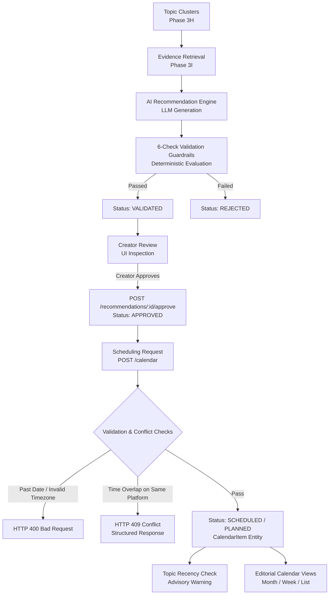

# Phase 3J: Content Calendar & Planning Management Architecture

## 1. Executive Summary & Design Principles

Phase 3J extends PulseGPT's audience intelligence and evidence-grounded recommendation pipeline into a **creator-controlled editorial content planning and scheduling system**.



### Core Invariants & Boundaries
1. **Creator in Full Control**: AI never automatically approves, schedules, or alters content plans. AI provides suggestions; creator makes decisions.
2. **No Automatic Publishing**: PulseGPT in Phase 3J plans content on an editorial calendar; it does **not** call social media publishing endpoints or automate live posting.
3. **Strict Recommendation State Lifecycle**:
   - `GENERATED` → `VALIDATED` (via 6-check guardrails)
   - `VALIDATED` → `APPROVED` (via explicit creator approval)
   - `APPROVED` → `SCHEDULED` (via calendar placement)
   - `REJECTED` drafts can never be approved or scheduled.
4. **Deterministic Conflict Resolution**: No LLM makes scheduling or conflict resolution decisions. Spring Boot evaluates deterministic overlap logic and returns HTTP 409 Conflict payloads.

---

## 2. Recommendation Approval Flow

### Lifecycle Transitions
```
   [GENERATED]
        │
   (6-Check Validation)
        ├── Pass ──> [VALIDATED] ── (Creator Approval) ──> [APPROVED] ── (Schedule) ──> [SCHEDULED]
        │                                                                               │
        └── Fail ──> [REJECTED]                                                  (Cancel) ──> [CANCELLED]
                         │
                    (Cannot Approve)
```

### Approval Endpoint
- **Method**: `POST /api/v1/recommendations/{id}/approve`
- **Security**: Requires JWT authentication. Verified against `user_id` ownership (returns `404 Not Found` for cross-user attempts).
- **Validation**:
  - If status is `VALIDATED`: transitions to `APPROVED`, sets `approved_at = NOW()`, `approved_by = current_user_id`.
  - If status is `APPROVED`: idempotent success return.
  - If status is `GENERATED` or `REJECTED`: rejects with `HTTP 400 Bad Request` (`INVALID_RECOMMENDATION_STATUS`).
- **Audit**: Emits `RECOMMENDATION_APPROVED` audit event with recommendation ID, title, and topic.

---

## 3. Calendar Item Lifecycle & Data Model

### Entity Schema (`calendar_items`)
| Column | Type | Constraints | Description |
|---|---|---|---|
| `id` | `UUID` | `PRIMARY KEY` | Unique identifier |
| `user_id` | `UUID` | `NOT NULL, FK -> users(id)` | Creator isolation boundary |
| `recommendation_id` | `UUID` | `FK -> content_recommendations(id)` | Upstream recommendation provenance |
| `topic_id` | `UUID` | `FK -> topics(id)` | Upstream topic cluster provenance |
| `title` | `VARCHAR(500)` | `NOT NULL` | Planned content title |
| `notes` / `description` | `TEXT` | `NULLABLE` | Production notes and outline |
| `content_type` | `VARCHAR(64)` | `DEFAULT 'VIDEO'` | Format: VIDEO, SHORT, CAROUSEL, POST |
| `platform` | `VARCHAR(32)` | `NOT NULL` | Target platform (YOUTUBE, INSTAGRAM, etc.) |
| `scheduled_start` | `TIMESTAMPTZ` | `NOT NULL` | Planned start instant |
| `scheduled_end` | `TIMESTAMPTZ` | `NOT NULL` | Planned end instant |
| `timezone` | `VARCHAR(64)` | `NOT NULL, DEFAULT 'UTC'` | Explicit IANA timezone (e.g. `Asia/Kolkata`) |
| `status` | `VARCHAR(32)` | `NOT NULL` | `PLANNED`, `SCHEDULED`, `CANCELLED`, `COMPLETED` |
| `priority` | `VARCHAR(32)` | `DEFAULT 'MEDIUM'` | `LOW`, `MEDIUM`, `HIGH` |
| `approved_at` | `TIMESTAMPTZ` | `NULLABLE` | Creator approval timestamp |
| `cancelled_at` | `TIMESTAMPTZ` | `NULLABLE` | Creator cancellation timestamp |
| `created_at` / `updated_at` | `TIMESTAMPTZ` | `NOT NULL` | Audit timestamps |

---

## 4. Deterministic Conflict Detection

Scheduling conflicts are evaluated deterministically against active calendar items (`SCHEDULED`, `PLANNED`) belonging to the authenticated user on the **same platform**:

$$\text{Conflict} \iff \text{existing.scheduledStart} < \text{new.scheduledEnd} \land \text{existing.scheduledEnd} > \text{new.scheduledStart}$$

### Rules
1. **Platform Independence**: Two items scheduled at the exact same time on *different* platforms (e.g., a YouTube Video and an Instagram Post at 18:00) are **allowed** simultaneously.
2. **Same Platform Overlap**: Items on the same platform that overlap in time trigger `HTTP 409 Conflict`.
3. **Rescheduling Exclusion**: When updating an existing item via `PATCH /api/v1/calendar/{id}`, the item's own ID is excluded from conflict evaluation.

### Structured Conflict Response (`HTTP 409`)
```json
{
  "conflict": true,
  "message": "Scheduling conflict detected on YOUTUBE with existing planned content",
  "conflicts": [
    {
      "calendarItemId": "59c97a2c-ad15-4e73-8d71-88e47ab10b28",
      "title": "React 19 Deep Dive Video",
      "platform": "YOUTUBE",
      "scheduledStart": "2026-10-18T18:00:00Z",
      "scheduledEnd": "2026-10-18T19:00:00Z"
    }
  ]
}
```

---

## 5. Timezone & Past Date Handling

1. **Explicit IANA Timezone Validation**:
   - Timezones are passed as standard IANA IDs (e.g., `Asia/Kolkata`, `America/New_York`, `UTC`).
   - Validated via `java.time.ZoneId.of(timezone)`. Invalid identifiers return `HTTP 400 Bad Request` (`INVALID_TIMEZONE`).
2. **Past Date Rejection**:
   - New schedules cannot be created in the past (`scheduledStart < now - 2min`).
   - Rescheduling to a past date is rejected with `HTTP 400 Bad Request` (`PAST_DATE_NOT_ALLOWED`).

---

## 6. Topic Diversity & Recency Warning

To prevent content fatigue, scheduling checks whether the associated topic was scheduled within a **$\pm 7$ day window**:
- If prior items with the same `topic_id` exist within the window, the API responds with an advisory `TopicRecencyWarning`:
  ```json
  {
    "type": "TOPIC_RECENCY_WARNING",
    "message": "Topic 'Production RAG Optimization' was scheduled recently (on 2026-10-14T18:00:00Z). Consider diversifying topics.",
    "severity": "WARNING",
    "topicId": "349d97d0-1b2c-4903-bb9e-210190289ab1",
    "lastScheduledDate": "2026-10-14T18:00:00Z"
  }
  ```
- **Advisory Only**: Does not block scheduling, leaving the strategic decision to the creator.

---

## 7. Deterministic Slot Suggestions

- **Endpoint**: `GET /api/v1/calendar/suggestions?date=2026-10-18&platform=YOUTUBE&timezone=Asia/Kolkata`
- Evaluates canonical creator posting windows:
  - **Morning**: 09:00 - 10:00 (Local Time)
  - **Afternoon**: 13:00 - 14:00 (Local Time)
  - **Evening**: 18:00 - 19:00 (Local Time)
- Converts to UTC instants based on the creator's timezone and checks real-time availability against existing calendar items.

---

## 8. Audit Trail & Research Instrumentation

Phase 3J instruments key creator decisions for audience intelligence analytics and research:
- `RECOMMENDATION_APPROVED`: Tracks creator acceptance rate of AI suggestions.
- `CALENDAR_ITEM_CREATED`: Records recommendation-to-calendar conversion, topic ID, platform, and scheduled time.
- `CALENDAR_ITEM_UPDATED`: Records schedule modifications.
- `CALENDAR_ITEM_CANCELLED`: Records cancellation reasons while preserving historical schedule rows.
- `CALENDAR_CONFLICT_DETECTED`: Records frequency and distribution of overlapping creator plans.

---

## 9. REST API Summary

| Endpoint | Method | Description |
|---|---|---|
| `/api/v1/recommendations/{id}/approve` | `POST` | Creator approves validated draft |
| `/api/v1/calendar` | `POST` | Schedule plan or approved recommendation |
| `/api/v1/calendar` | `GET` | Paginated calendar query (Month/Week/List/Filters) |
| `/api/v1/calendar/{id}` | `GET` | Get single item with recommendation & topic provenance |
| `/api/v1/calendar/{id}` | `PATCH` | Reschedule or edit plan with conflict check |
| `/api/v1/calendar/{id}/cancel` | `POST` | Soft-cancel item preserving audit trail |
| `/api/v1/calendar/{id}` | `DELETE` | Delete draft or cancel active plan |
| `/api/v1/calendar/conflicts` | `GET` | Test conflict availability before submission |
| `/api/v1/calendar/suggestions` | `GET` | Deterministic morning/afternoon/evening slots |

---

## 10. Boundary of Phase 3J

Phase 3J completes **Content Calendar & Planning Management**.
- **Out of Scope**: Live social publishing (YouTube Data API `videos.insert`, Twitter/X API v2 publishing, etc.), autonomous agent auto-posting, and conversational agent memory graphs.
- **Future Phase (Phase 3K)**: Multi-Modal Asset Generation / Content Scripting Copilot / Workflow Automation.
