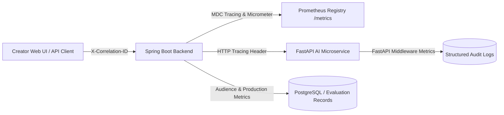

# Production Observability, Metrics & Telemetry Specification

**Codename**: PulseGPT  
**Phase**: 3M — Production Observability, Evaluation & Research Experimentation  
**Standard**: Spring Boot Actuator, Micrometer Prometheus, MDC Tracing, FastAPI Observability Middleware

---

## 1. Executive Summary

PulseGPT implements an enterprise-grade, privacy-compliant observability and telemetry framework spanning the Spring Boot orchestration tier, the FastAPI NLP/ML microservice, and creator UI telemetry. The system tracks metrics across 8 core domain subsystems without leaking creator PII or raw audience feedback into monitoring streams.

---

## 2. Distributed Tracing & Correlation IDs

1. **Generation & Extraction**: Incoming HTTP requests to Spring Boot are assigned a unique UUID `X-Correlation-ID` header if not present.
2. **MDC Injection**: Injected into `org.slf4j.MDC` as `correlationId` for all asynchronous and synchronous logging.
3. **Microservice Propagation**: Propagated across the internal `AiServiceClient` using a RestClient request interceptor to the FastAPI microservice.
4. **FastAPI Middleware**: FastAPI captures `X-Correlation-ID`, logs response time in milliseconds, and emits `X-Response-Time` and `X-Correlation-ID` in HTTP response headers.

---

## 3. Micrometer Domain Metrics Catalog

All metrics are registered with the Spring Boot `MeterRegistry` and exposed via Prometheus `/actuator/prometheus`.

| Metric Name | Type | Unit | Description | Tags / Dimensions |
| :--- | :--- | :--- | :--- | :--- |
| `pulsegpt.ingestion.comments.total` | Counter | items | Total audience comments ingested | `platform`, `status` |
| `pulsegpt.ingestion.duration` | Timer | ms | Time spent fetching and deduplicating | `platform` |
| `pulsegpt.nlp.inference.duration` | Timer | ms | Embedding & sentiment inference duration | `model`, `task` |
| `pulsegpt.nlp.errors.total` | Counter | errors | Total NLP inference failures | `model`, `error_type` |
| `pulsegpt.clustering.duration` | Timer | ms | HDBSCAN clustering computation latency | `algorithm` |
| `pulsegpt.clustering.clusters.count` | Distribution | clusters | Number of topic clusters produced per run | `algorithm` |
| `pulsegpt.clustering.noise.ratio` | Gauge | ratio | Ratio of unclustered outlier comments | `algorithm` |
| `pulsegpt.recommendation.generation.duration`| Timer | ms | LLM content recommendation latency | `model`, `mode` |
| `pulsegpt.recommendation.validation.total` | Counter | items | 6-point verification outcomes | `status`, `check` |
| `pulsegpt.production.copilot.duration` | Timer | ms | Content brief / outline generation duration | `asset_type`, `mode` |
| `pulsegpt.production.validation.pass_rate` | Counter | checks | Production verification pass rate | `asset_type`, `status` |
| `pulsegpt.production.repairs.total` | Counter | items | Auto-repair loop attempts and outcomes | `outcome` |
| `pulsegpt.creator.actions.total` | Counter | actions | Creator workflow actions | `action_type` |
| `pulsegpt.export.duration` | Timer | ms | Document generation latency | `export_type` |
| `pulsegpt.export.total` | Counter | items | Multi-format exports produced | `export_type`, `status` |

---

## 4. Actuator Health Probes

Spring Boot Actuator health endpoints are configured with custom health indicators:

- `/actuator/health`: Aggregated health status including Database and AI microservice probe.
- `AiServiceHealthIndicator`: Calls FastAPI `/health` endpoint with a 3000ms timeout; flags `DOWN` or `DEGRADED` if response status is not 200.

---

## 5. Privacy & Anonymization in Monitoring

To comply with creator privacy and data ethics:
1. Metric tags contain **only discrete categorical dimensions** (e.g. `platform`, `asset_type`, `status`).
2. **Zero PII**: Channel names, comment texts, user emails, and raw tokens are strictly prohibited in Prometheus metric tags and Actuator traces.
3. Database snapshot exports sanitize user identifiable information prior to frozen evaluation storage.
