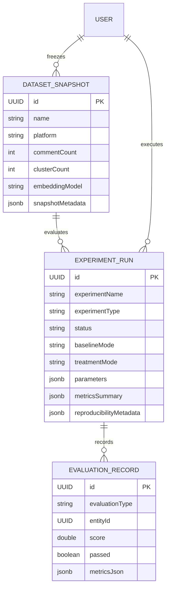

# Research & Evaluation Methodology Specification

**Codename**: PulseGPT  
**Phase**: 3M — Production Observability, Evaluation & Research Experimentation  
**Scope**: Empirical Evaluation Architecture for 2 Academic Research Papers

---

## 1. Research Objectives & Paper Alignment

PulseGPT provides an evaluation and experimentation subsystem designed to directly support empirical findings and reproducibility for two research papers:

### Paper 1: *Semantic Clustering of Multi-Platform Audience Feedback*
- **Core Hypothesis**: HDBSCAN clustering on dense sentence embeddings (`all-MiniLM-L6-v2`, 384d) provides superior noise separation and centroid stability across disparate social platforms (YouTube, Reddit) compared to traditional centroid-based approaches (K-Means) or static thresholding.
- **Key Metrics**:
  - **Centroid Cosine Stability**: Mean cosine similarity between corresponding cluster centroids across runs with different random seeds.
  - **Noise Ratio**: Percentage of unclustered outlier comments ($\text{Noise} / N$).
  - **Silhouette & Davies-Bouldin Scores**: Intra-cluster compactness vs inter-cluster separation.

### Paper 2: *Evidence-Grounded LLM-Based Content Recommendations & Production Assist*
- **Core Hypothesis**: Grounding generative LLM prompts with verified audience comment clusters (Audience Evidence Snapshots) and enforcing a 6-point verification gate with automated repair drastically reduces unsupported claims (hallucinations) while increasing creator acceptance rates.
- **Key Metrics**:
  - **Evidence Coverage Ratio**: Percentage of claims in generated briefs/scripts backed by valid comment citations.
  - **Validation Pass Rate**: Percentage of generated assets passing all 6 deterministic schema & grounding checks.
  - **Auto-Repair Success Rate**: Percentage of initially failing outputs corrected within 1 repair loop.
  - **Creator Edit Rate**: Percentage of text modified by creators before approval.
  - **Novelty Score**: Cosine distance relative to recent creator historical content.

---

## 2. Research Data Model & Entities

---

## 3. Baseline vs Treatment Experimental Protocols

| Dimension | Baseline Protocol | Treatment Protocol (PulseGPT) |
| :--- | :--- | :--- |
| **Recommendation Generation** | Zero-Shot LLM prompt without evidence snapshot (`BASELINE_UNGROUNDED`) | Grounded LLM prompt with verified comment cluster excerpts (`EVIDENCE_GROUNDED`) |
| **Production Copilot** | Single-pass raw generation (`SINGLE_PASS_RAW`) | 6-point verification + 1-step JSON repair loop (`VERIFY_AND_REPAIR_LOOP`) |
| **Clustering Stability** | Unseeded / Standard Agglomerative Clustering | Seed-controlled HDBSCAN with euclidean distance & cluster selection epsilon |

---

## 4. Reproducibility & Determinism Controls

To ensure absolute reproducibility across research environments:
1. **Reproducibility Registry (`ReproducibilityMetadata.java`)**:
   - Model versions: `gemini-1.5-flash` (`2026.1`)
   - Prompt versions: `PROMPT_V1`, `PRODUCTION_PROMPT_V1`
   - Embedding models: `all-MiniLM-L6-v2` (384-dimensional)
   - Fixed random seeds: Default seed `42` (customizable per trial)
2. **Dataset Snapshots**:
   - Captures frozen comment samples, date intervals, platform scopes, and cluster state hashes.
3. **Deterministic Exporter**:
   - Document generation produces bit-level reproducible outputs with SHA-256 integrity verification.
